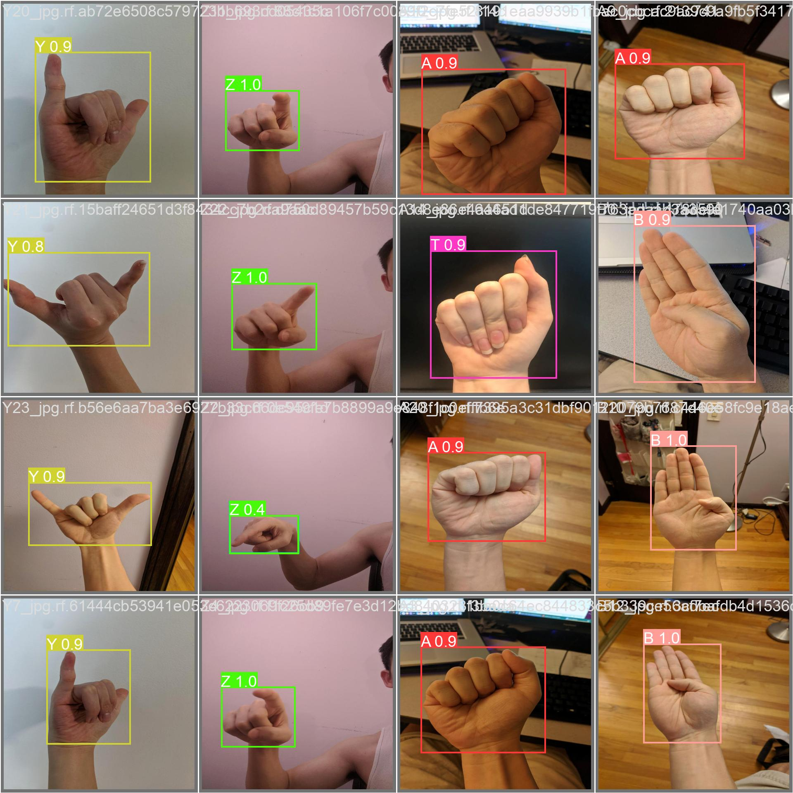
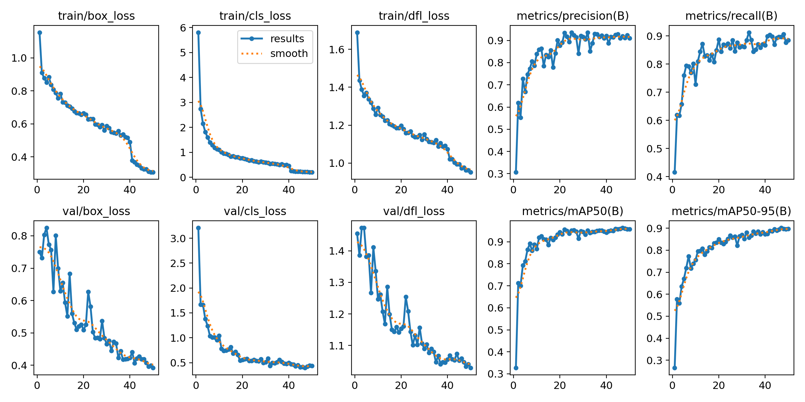

# Sign Language Converter

This project uses a YOLOv8 model to detect and convert sign language gestures from images and videos into text. The annotated images highlight the detected gestures with bounding boxes and labels.

Here's an example of an annotated image with detected sign language gesture:


## Installation

1. **Clone the repository**:
    ```sh
    git clone https://github.com/justsomerandomdude264/Sign_Language_Converter.git
    cd Sign_Language_Converter
    ```

2. **Make the Docker image**:
    ```sh
    docker-compose build
    ```

## Metrics

- **Validation Metrics**
  
    | Class | Box Precision | Recall    | mAP50 | mAP50-95 |
    |-------|---------------|------|--------|----------|
    ||||||
    | **FINAL**  | 0.919  | 0.898| **0.963** | **0.901** |
    ||||||
    | A     | 0.947  | 0.8  | **0.906** | **0.906** |
    | B     | 1.0    | 0.76 | **0.984** | **0.931** |
    | C     | 1.0    | 0.955| **0.995** | **0.864** |
    | D     | 0.723  | 1.0  | **0.995** | **0.937** |
    | E     | 1.0    | 0.874| **0.995** | **0.995** |
    | F     | 0.887  | 1.0  | **0.995** | **0.961** |
    | G     | 0.918  | 1.0  | **0.995** | **0.978** |
    | H     | 0.997  | 1.0  | **0.995** | **0.963** |
    | I     | 0.861  | 0.5  | **0.506** | **0.455** |
    | J     | 0.87   | 1.0  | **0.982** | **0.76**  |
    | K     | 1.0    | 0.935| **0.995** | **0.955** |
    | L     | 0.783  | 1.0  | **0.945** | **0.926** |
    | M     | 1.0    | 0.923| **0.995** | **0.943** |
    | N     | 0.771  | 0.853| **0.945** | **0.927** |
    | O     | 1.0    | 0.759| **0.995** | **0.916** |
    | P     | 0.997  | 1.0  | **0.995** | **0.884** |
    | Q     | 0.958  | 1.0  | **0.995** | **0.808** |
    | R     | 1.0    | 0.913| **0.995** | **0.962** |
    | S     | 0.944  | 1.0  | **0.995** | **0.995** |
    | T     | 0.762  | 0.833| **0.927** | **0.89**  |
    | U     | 0.955  | 1.0  | **0.995** | **0.97**  |
    | V     | 1.0    | 0.47 | **0.938** | **0.867** |
    | W     | 0.773  | 1.0  | **0.995** | **0.964** |
    | X     | 0.74   | 1.0  | **0.995** | **0.895** |
    | Y     | 1.0    | 0.897| **0.995** | **0.845** |
    | Z     | 1.0    | 0.87 | **0.995** | **0.928** |


- **Predictions on Test Images**

    


- **Train Graphs**

    

## Usage

1. **Run the Backend Server**:
    ```sh
    docker-compose up
    ```
    
3. **Upload Media**:
    - Use the web interface to upload images or videos containing sign language gestures or use the images in the `test_images` folder.
    - The results will be displayed with annotations and converted text.

## How It Works

1. **Frontend**:
    - The frontend is built with React and provides a user-friendly interface to upload images and videos. 
    - It displays the selected file, loads during processing, and presents the annotated media along with the detected text.

2. **Backend**:
    - The backend is built with Python and Django, utilizing the YOLOv8 model for object detection.
    - When a media file is uploaded, the backend processes the file, runs the YOLOv8 model to detect sign language gestures, and returns the results to the frontend.

3. **Processing Images**:
    - The image is read using OpenCV and passed to the YOLOv8 model for detection.
    - Detected gestures are annotated with bounding boxes and labels.
    - The processed image and annotations are returned to the frontend for display.

4. **Processing Videos**:
    - The video is processed frame-by-frame using OpenCV.
    - Every frame is analyzed to detect gestures using the finetuned YOLOv8 model .
    - Detected gestures are annotated similarly to images, and unique detected texts are aggregated.
    - The annotations and converted text are sent back to the frontend.

## How I Made It

1. **Model Training**:
    - The YOLOv8 model was trained using a dataset of sign language gestures.
    - The training process involved annotating images with bounding boxes for each gesture and fine-tuning the model to improve accuracy.

2. **Backend Development**:
    - The backend server was developed using Django.
    - Routes were created to handle file uploads and process images and videos using the trained YOLOv8 model.
    - The model's output is formatted and sent back to the frontend.

3. **Frontend Development**:
    - The frontend was created using React.
    - Components were designed to handle file selection, upload, and display of results.
    - Integration with the backend was done using Axios for POST API requests.

## Project Structure

- `Sign_Language_Converter/`: Contains the server-side code (django backend) and YOLOv8 model processing.
- `frontend/`: Contains the React-based web interface for uploading media and displaying results.
- `test_images/`: Includes three images to test the program out.

## Dataset

In this project I used a dataset made by David Lee named American Sign Language Letters Dataset.   <br />
Link- `https://public.roboflow.com/object-detection/american-sign-language-letters`

## Contributing

Contributions are welcome! Please fork the repository and submit a pull request.
